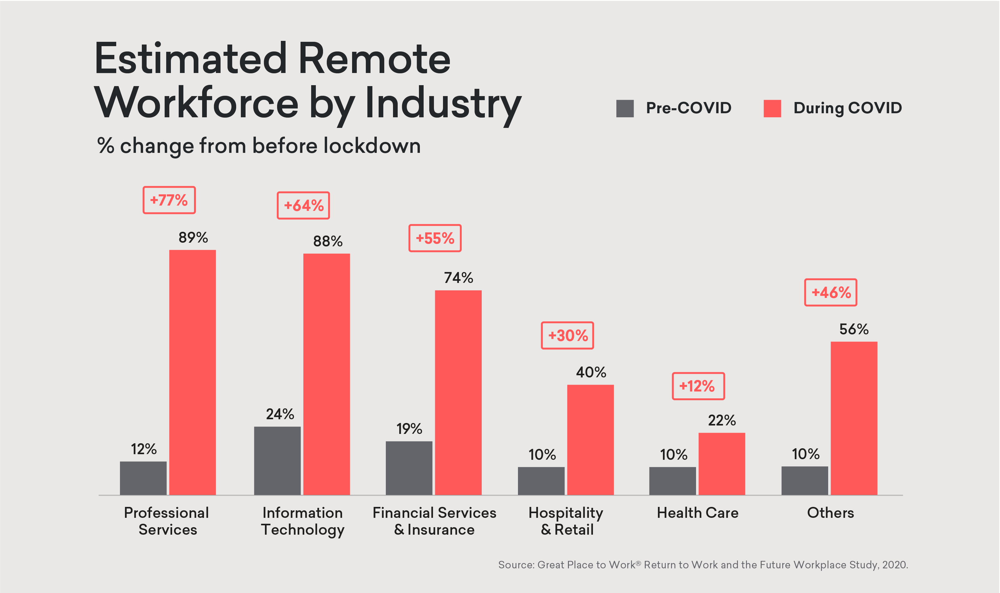
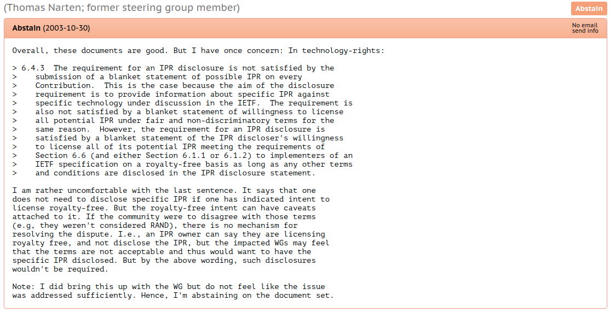
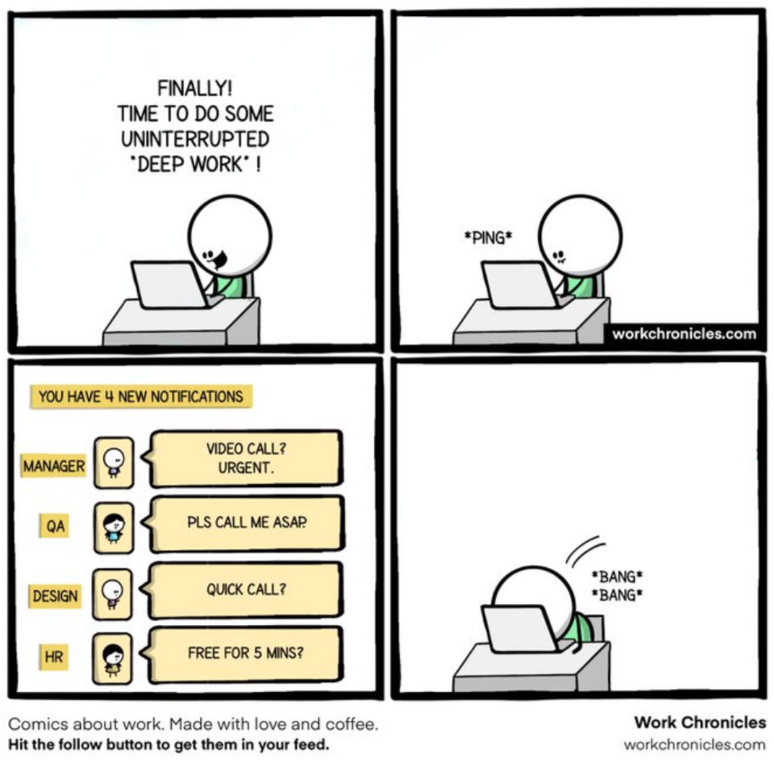
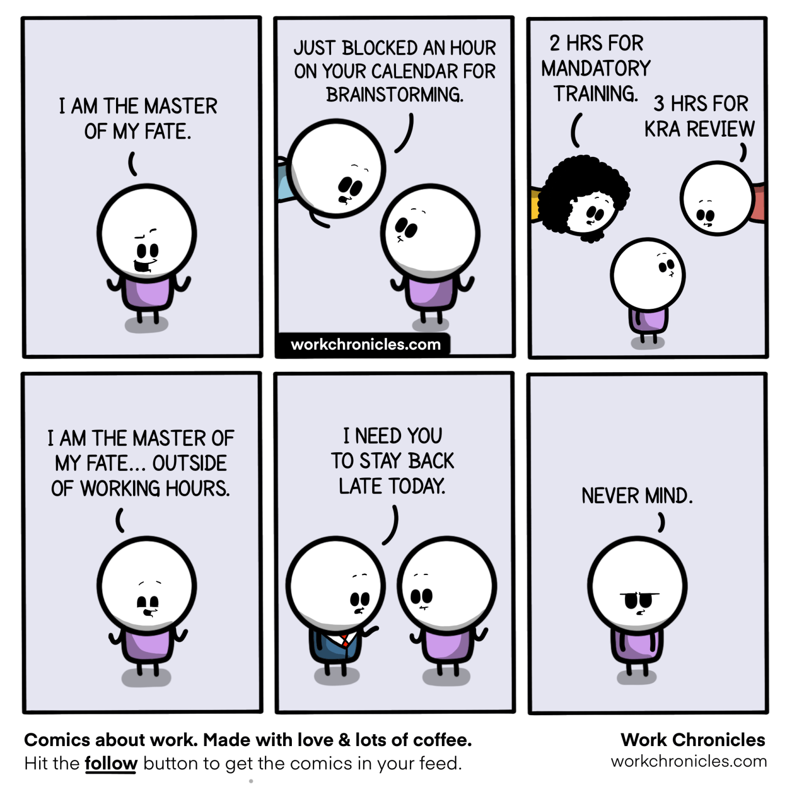

.. A importancia da documentacao no trabalho distribuido documentation master file, created by
   sphinx-quickstart on Mon Oct  4 16:12:55 2021.

.. role:: emphasize
.. role:: lighten

Trabalho Distribuído
====================

Além do Home Office

.. image:: _static/gorn2021.png
    :width: 300
    :alt: Go! RN 2021

.. rst-class:: text-and-picture

Agenda
------

* Quem sou eu?
* Padrões de distribuição de equipes
* COVID-19 acelerou a tendência
* Modelo de trabalho híbrido?
* Padrões de comunicação
* Reuniões e senso de urgência
* Socialize e celebre
* Perguntas
* Referências

.. rst-class:: citation-reference

Fonte: https://pixabay.com/illustrations/remote-work-office-home-office-5491791/

.. rst-class:: no-title centered-title-slide

Apenas a minha opinião!
-----------------------

.. rst-class:: text-and-picture

Quem sou eu?
------------

* :emphasize:`Vinicius Mendes`
  
    - Back-end Python Engineer @ :emphasize:`Loadsmart` desde abr/21
    - Antes: 

        -  Solucione Sistemas
        -  Globo.com
        -  Dataprev
        -  Professor Substituto na UFRN
    
.. image:: _static/profile-picture.jpg
    :width: 340
    :alt: Minha foto com minha estação de trabalho ao fundo

.. rst-class::  centered-image-slide

Tweetabadá (2009)
-----------------

Também atendeu outros propósitos em :emphasize:`São Paulo` e em :emphasize:`Santa Catarina`.

.. rst-class:: no-title centered-title-slide

"Não existe essa simples dicotomia de :emphasize:`remoto versus presencial`."
-----------------------------------------------------------------------------

.. rst-class:: quote-citation

(Martin Fowler, 2015)

.. rst-class:: citation-reference

Fonte: https://martinfowler.com/articles/remote-or-co-located.html

.. rst-class:: centered-image-slide

Padrões de distribuíção de times
--------------------------------

.. image:: _static/remote-collocated.png
    :width: 600
    :alt: Figura descrevendo 4 categorias de trabalho: single-site, multi-site, sattelite workers e remote-first
    :align: center

.. rst-class:: citation-reference

Fonte: https://martinfowler.com/articles/remote-or-co-located.html

.. rst-class:: text-and-picture

Single-site ou um único lugar
-----------------------------

- Toda a equipe trabalha :emphasize:`fisicamente próxima`
- Permite :emphasize:`rápida colaboração` sem precisar de muitas ferramentas
- É possível saber facilmente :emphasize:`quem está trabalhando`

.. image:: _static/single-site.png
    :width: 400
    :alt: Figura descrevendo a distribuição de equipes single-site
    :align: center

.. rst-class:: citation-reference

Fonte: https://martinfowler.com/articles/remote-or-co-located.html

.. rst-class:: text-and-picture

Multi-site ou um vários lugares
-------------------------------

- A equipe está dividida em :emphasize:`dois ou mais grupos` em :emphasize:`diferentes lugares`
- Possui características semelhantes ao single-site :emphasize:`dentro de cada grupo`
- Pode gerar :emphasize:`ilhas de conhecimento` entre os diferentes lugares

.. image:: _static/multi-site.png
    :width: 400
    :alt: Figura descrevendo a distribuição de equipes multi-site
    :align: center

.. rst-class:: citation-reference

Fonte: https://martinfowler.com/articles/remote-or-co-located.html

.. rst-class:: text-and-picture

Trabalhadores satélite
----------------------

- Boa parte de equipe trabalha nos modelos :emphasize:`single-site ou multi-site`
- Existem membros do time trabalhando :emphasize:`remotamente`
- Deve-se ter :emphasize:`cuidado e empatia para incluir` estes trabalhadores remotos

.. image:: _static/satellite-workers.png
    :width: 400
    :alt: Figura descrevendo a distribuição de equipes com trabalhadores satélite
    :align: center

.. rst-class:: citation-reference

Fonte: https://martinfowler.com/articles/remote-or-co-located.html

.. rst-class:: text-and-picture

Remote-first ou trabalho distribuido
------------------------------------

- Toda a equipe trabalha :emphasize:`fisicamente distante`
- A colaboração ocorre em um :emphasize:`ambiente virtual`
- Mais difícil de aplicar modelos de :emphasize:`comando e controle`

.. image:: _static/remote-first.png
    :width: 400
    :alt: Figura descrevendo a distribuição de equipes remote-first
    :align: center

.. rst-class:: citation-reference

Fonte: https://martinfowler.com/articles/remote-or-co-located.html

.. rst-class:: no-title centered-image-slide

Empresas adotam home-office por conta do coronavírus
----------------------------------------------------

.. rst-class:: border-shadow

.. image:: _static/empresas-adotam-home-office.png
    :width: 900
    :alt: Captura de tela da matéria da Agência Brasil
    :align: center

.. rst-class:: citation-reference

Fonte: https://agenciabrasil.ebc.com.br/saude/noticia/2020-03/empresas-adotam-home-office-por-conta-do-coronavirus

.. rst-class:: centered-image-slide

Estimativa de trabalhadores remotos
-----------------------------------

.. rst-class:: border-shadow

.. rst-class:: citation-reference

https://www.greatplacetowork.com/resources/blog/new-survey-fortune-500-ceos-reveal-what-the-future-office-will-look-like-post-covid

.. rst-class:: centered-image-slide

O que pensam os CEOs da Fortune 500?
------------------------------------

.. rst-class:: border-shadow

.. image:: _static/remoteness-by-industry.png
    :width: 850
    :align: center

.. rst-class:: citation-reference

https://www.greatplacetowork.com/resources/blog/new-survey-fortune-500-ceos-reveal-what-the-future-office-will-look-like-post-covid

.. rst-class:: centered-image-slide

Pesquisa: Retorno ao local de trabalho Mar/2021
-----------------------------------------------

.. rst-class:: border-shadow

.. rst-class:: citation-reference

Fonte: https://envoy.com/content/ebook/ds02/as/hybrid-work-survey-executive-summary/

.. rst-class:: centered-image-slide

Pesquisa: Retorno ao local de trabalho Mar/2021
-----------------------------------------------

.. rst-class:: border-shadow

.. image:: _static/47-percent-look-another-job.png
    :width: 550
    :align: center

.. rst-class:: citation-reference

Fonte: https://envoy.com/content/ebook/ds02/as/hybrid-work-survey-executive-summary/

.. rst-class:: centered-image-slide

Pesquisa: Retorno ao local de trabalho Mar/2021
-----------------------------------------------

.. rst-class:: border-shadow

.. image:: _static/lower-salary-to-have-flexible-work-environment.png
    :width: 550
    :align: center

.. rst-class:: citation-reference

Fonte: https://envoy.com/content/ebook/ds02/as/hybrid-work-survey-executive-summary/

.. rst-class:: centered-image-slide

Pesquisa: Trabalho Híbrido (Deloitte, 2021)
-------------------------------------------

.. rst-class:: border-shadow

.. image:: _static/majority-of-employees-prefer-to-work-from-home.png
    :width: 550
    :align: center

.. rst-class:: citation-reference

Fonte: https://www2.deloitte.com/content/dam/Deloitte/sk/Documents/human-capital/Brochure_Hybrid_work_survey.pdf

.. rst-class:: text-and-picture

Híbrido?
--------

- Para mim é :emphasize:`bastante complexo`
- Vai existir um :emphasize:`regime fixo de escala`?
- O que funcionava no remoto :emphasize:`deixou de funcionar` no híbrido?
- Quem não está trabalhando presencialmente:

  - está sendo :emphasize:`incluído nas decisões`?
  - tem o mesmo :emphasize:`contexto` que teria se estivesse presencial?

.. image:: _static/remote-collocated.png
    :width: 350
    :alt: Figura descrevendo 4 categorias de trabalho: single-site, multi-site, sattelite workers e remote-first
    :align: center

.. rst-class:: citation-reference

Fonte: https://martinfowler.com/articles/remote-or-co-located.html

.. rst-class:: centered-image-slide

Híbrido?
--------

.. image:: _static/hybrid-remote-first-single-site.png
    :width: 450
    :align: center

.. rst-class:: citation-reference

Fonte: https://martinfowler.com/articles/remote-or-co-located.html (Modificado)

.. rst-class:: centered-image-slide

Híbrido?
--------

.. image:: _static/satellite-workers.png
    :width: 450
    :align: center

.. rst-class:: citation-reference

Fonte: https://martinfowler.com/articles/remote-or-co-located.html

.. rst-class:: centered-title-slide

":emphasize:`Trabalho remoto` é uma disciplina para o :emphasize:`trabalhador individual`, mas :emphasize:`trabalho distribuído` é uma disciplina para :emphasize:`toda a organização`."
----------------------------------------------------------------------------------------------------------------------------------------------------------------------------------------

.. rst-class:: quote-citation

(Antony Wing Kosner, 2020)

.. rst-class:: citation-reference

Fonte: https://blog.dropbox.com/topics/work-culture/the-crucial-difference-between-remote-work-and-distributed-work

.. rst-class:: centered-title-slide

Padrões de comunicação
----------------------

Comunicação síncrona
--------------------

.. rst-class:: centered-image

.. image:: _static/sync-communication.png
    :width: 900
    :align: center

- Geralmente demanda uma :emphasize:`interação imediata`
- Tende a ser uma comunicação :emphasize:`mais rápida`
- Se não houver o devido registro se torna :emphasize:`efêmera`
- Oferece pouco espaço para análise e elaboração e propicia :emphasize:`decisões menos embasadas`
- Pode :emphasize:`comprometer o foco` em tarefas mais complexas

Comunicação assíncrona
----------------------

.. rst-class:: centered-image

.. image:: _static/async-communication.png
    :width: 900
    :align: center

- Pode esperar o interlocutor ter :emphasize:`disponibilidade para responder`
- Permite uma análise mais elaborada e propicia :emphasize:`decisões mais embasadas`
- Geralmente já mantém o :emphasize:`registro do diálogo` automaticamente

  - Ainda é preciso ter :emphasize:`cuidado` para não deixar os :emphasize:`registros muito espalhados`

.. rst-class:: no-title centered-image-slide
.. nextslide::

.. image:: _static/mail-gnu.png
    :width: 900
    :alt: E-mail onde Richard Stallman anuncia o GNU
    :align: center

.. rst-class:: citation-reference

Fonte: https://groups.google.com/g/net.unix-wizards/c/8twfRPM79u0/m/1xlglzrWrU0J

.. rst-class:: no-title centered-image-slide
.. nextslide::

.. image:: _static/pep.png
    :width: 900
    :alt: Página inicial dos PEPs
    :align: center

.. rst-class:: citation-reference

Fonte: https://www.python.org/dev/peps/

.. rst-class:: no-title centered-image-slide
.. nextslide::

.. image:: _static/rfc.png
    :width: 600
    :alt: Exemplo de RFC 2026 que explica o processo de padronização da internet
    :align: center

.. rst-class:: citation-reference

Fonte: https://datatracker.ietf.org/doc/html/rfc2026

.. rst-class:: no-title centered-image-slide
.. nextslide::

.. rst-class:: citation-reference

Fonte: https://datatracker.ietf.org/doc/rfc3667/ballot/

Ferramentas para colaboração distribuída
----------------------------------------

- Mensageiros instantâneos: :emphasize:`Whatsapp, Telegram, Slack, Discord, Teams`

  - Dependendo do :emphasize:`grau de urgência` da resposta podem se confundir com comunicações síncronas

- :emphasize:`E-mails, Wikis, Documentos`
- Ferramentas Colaborativas: :emphasize:`Figma, Notion, Google Docs, Office 365`
- Lousas virtuais: :emphasize:`Miro, Mural, Excalidraw`
- Assinatura de documentos: :emphasize:`Docusign, Certificado digital A3`
- Dê preferência a diferentes ferramentas para a :emphasize:`vida social e a profissional`

  - Se não for possível tente :emphasize:`contas distintas`

Assinatura digital vs Assinatura digitalizada
---------------------------------------------

- Assinatura digital

  - Baseada em criptografia e garante a :emphasize:`autenticidade e a integridade` do documento.

- Assinatura digitalizada 

  - Uma imagem da assinatura física e é :emphasize:`facilmente fraudável`

.. rst-class:: centered-image-slide

Comunique-se mais através de fontes da verdade
----------------------------------------------

.. image:: _static/clarity-1.png
    :width: 1000
    :align: center

.. rst-class:: centered-image-slide

Comunique-se mais através de fontes da verdade
----------------------------------------------

.. image:: _static/clarity-2.png
    :width: 1000
    :align: center

.. rst-class:: centered-image-slide

Comunique-se mais através de fontes da verdade
----------------------------------------------

Clareza na comunicação
----------------------

- Torne a informação mais :emphasize:`acessível` para todos os membros da equipe
- Tenha :emphasize:`metas e expectativas` claras e transparentes
- :emphasize:`Comunicação em excesso` é melhor que falta de comunicação
- Tome cuidado para não mandar :emphasize:`mensagens diferentes` em canais diferentes

.. rst-class:: centered-image-slide

Etiqueta para comunicadores instantâneos
----------------------------------------

.. image:: _static/no-hello-donts.png
    :width: 800
    :align: center

https://nohello.net

.. rst-class:: centered-image-slide

Etiqueta para comunicadores instantâneos
----------------------------------------

https://nohello.net

Etiqueta para comunicadores instantâneos
----------------------------------------

- :emphasize:`Menos mensagens` significam menos notificações
- Escreva mensagens mais :emphasize:`completas e bem formatadas`
- Use :emphasize:`threads`, mas lembre-se de deixar todo mundo ciente das :emphasize:`mensagens mais importantes`
- Substitua mensagens pontuais por :emphasize:`emoji reactions`
- Mantenha o seu :emphasize:`perfil atualizado`: papel, equipe, jornada de trabalho
- Prefira :emphasize:`canais públicos` por padrão
- Use :emphasize:`menções` com sabedoria

.. rst-class:: citation-reference

Inspirador por: https://slack.com/intl/en-br/blog/collaboration/etiquette-tips-in-slack

Comunicadores instantãneos não são bases de conhecimento
--------------------------------------------------------

- Mova as discussões para :emphasize:`ferramentas mais específicas` do assunto em questão.
- Utilize os comunicadores para :emphasize:`informar as pessoas` de que você está esperando uma resposta em uma outra ferramenta.
- :emphasize:`Documente` os resultados das comunicações, sejam síncronas ou assíncronas.
- Evite :emphasize:`explicar várias vezes` a mesma coisa
- Se perceber que está fazendo isso, :emphasize:`pare e documente`
- Passe a responder mais com um :emphasize:`link pra documentação`
- Deixe bem documentado e você vai ter :emphasize:`mais tempo para produzir`.

Realizando uma tarefa de forma distribuída
------------------------------------------

- :emphasize:`Verifique` se as informações que você precisa estão bem documentadas.
- Se não encontrar, :emphasize:`pergunte em um canal público`. Não precisa ter vergonha.
- Ao fim, tente :emphasize:`contribuir` documentando a informação que estava faltando.
- :emphasize:`Peça revisão` do seu trabalho aos seus pares. É uma oportunidade para :emphasize:`corrigir falhas e disseminar conhecimento`.

Senso de urgência
-----------------

- Nem toda pergunta precisa de uma :emphasize:`resposa imediata`. Você deve definir a expectativa.

  - Se você pode esperar por horas, :emphasize:`mande a mensagem e espere`.
  - Se você precisa de uma resposta em poucos minutos, :emphasize:`mencione` alguém.
  - Se você precisa de uma resposta imediata, deixe isso :emphasize:`claro para todos`.

.. rst-class:: no-title centered-image-slide
.. nextslide::

.. rst-class:: citation-reference

Fonte: https://workchronicles.com/

Senso de urgência
-----------------

- Urgente e importante: :emphasize:`Faça`, mas evite este cenário
- Não urgente e importante: :emphasize:`Planeje`
- Urgente e não importante: :emphasize:`Evite`
- Não urgente e não importante: :emphasize:`Elimine`

Reuniões
--------

- Tenha uma :emphasize:`rotina clara` com a sua equipe
- Se você agendar uma :emphasize:`reunião`, forneça o máximo de contexto antes de iniciar

  - Entrar em uma reunião sem contexto suficiente pode levar a decisões ruins ou a desperdício de tempo

- O tempo gasto com uma reunião é :emphasize:`multiplicado pelo número de participantes`
- Reuniões sempre devem ter um :emphasize:`intervalo de tempo` bem definido e isto deve ser seguido.
- :emphasize:`Gravar uma reunião` pode ser útil, mas :emphasize:`tomar nota e documentar` as decisões pode ser melhor.
- Lembre-se que a equipe precisa de :emphasize:`tempo de concentração` suficiente para trabalhar nas tarefas.

.. rst-class:: no-title centered-image-slide
.. nextslide::

.. rst-class:: citation-reference

Fonte: https://workchronicles.com/

Comprometimento
---------------

- Trabalhar distribuído lhe dá mais liberdade, mas isso deve ser acompanhado de :emphasize:`responsabilidade`.
- :emphasize:`Confiança e transparência` são essenciais.
- O :emphasize:`engajamento` ocorre quando o trabalho se torna interessante

  - A distância física deixa de ser uma barreira para encontrar as :emphasize:`pessoas e as empresas certas`.

- Uma :emphasize:`prova de trabalho` realizado é mais valiosa que estar fisicamente presente 8 horas por dia.

.. rst-class:: centered-image-slide

Socialize com a equipe
----------------------

https://wonder.me

.. rst-class:: centered-image-slide

Socialize com a equipe
----------------------

https://donnut.com

.. rst-class:: centered-image-slide

Celebre as conquistas
---------------------

.. rst-class:: no-title centered-image-slide

Cultura Loadsmart
-----------------

.. image:: _static/loadsmart-culture.png
    :width: 1000
    :align: center

https://github.com/loadsmart/culture

.. rst-class:: last-slide

Se um trabalhador está remoto, o time inteiro deve trabalhar remoto.
--------------------------------------------------------------------

Obrigado pela atenção!

Slides: `vbmendes.github.io/distributed-work-beyond-the-home-office 
<https://vbmendes.github.io/distributed-work-beyond-the-home-office/>`_

Tem algo a adicionar? Fale comigo nestas redes:

- github.com/:emphasize:`vbmendes`
- twitter.com/:emphasize:`vbmendes`
- linkedin.com/in/:emphasize:`viniciusmendes`/

Estamos contratando: https://jobs.lever.co/loadsmart/

.. rst-class:: perguntas

Perguntas?

Referências
-----------------

- Podcast: Distributed, with Matt Mullenweg - https://distributed.blog/podcast/
- Officeless - https://www.officeless.cc/
- Remote: Office not required - https://www.amazon.com.br/Remote-Office-Required-Jason-Fried/dp/0804137501
- The definitive guide to remote development teams - https://x-team.com/blog/remote-team-guide/
